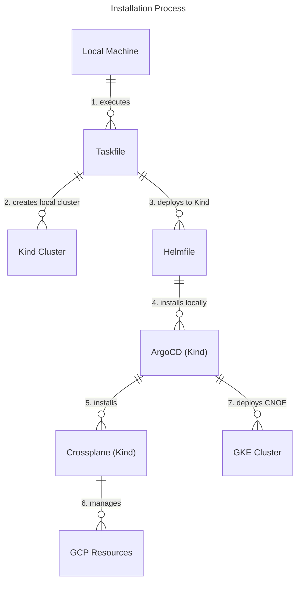

> [!NOTE]
> Applications deployed in this repository are a starting point to get environment into production.

<!-- omit from toc -->

# CNOE GCP Reference Implementation

This repository provides a reference implementation for deploying Cloud Native Operations Enabler (CNOE) components on Google Kubernetes Engine (GKE) using GitOps principles.

<!-- omit from toc -->

## Table of Contents

- [Architecture](#architecture)
  - [Deployed Components](#deployed-components)
- [Important Notes](#important-notes)
- [Prerequisites](#prerequisites)
  - [Required Azure Resources](#required-azure-resources)
    - [Setup Guidance for Azure Resources](#setup-guidance-for-azure-resources)
  - [GitHub Integration Setup](#github-integration-setup)
    - [Create GitHub App for Backstage](#create-github-app-for-backstage)
    - [Create GitHub Token](#create-github-token)
- [Installation Flow](#installation-flow)
- [Security Notes](#security-notes)
- [Installation Steps](#installation-steps)
  - [Installation Requirements](#installation-requirements)
  - [1. Configure the Installation](#1-configure-the-installation)
    - [DNS and TLS Configuration](#dns-and-tls-configuration)
      - [Automatic (Recommended)](#automatic-recommended)
      - [Manual](#manual)
  - [2. Install Components](#2-install-components)
  - [3. Monitor Installation](#3-monitor-installation)
  - [4. Get Access URLs](#4-get-access-urls)
  - [5. Access Backstage](#5-access-backstage)
- [Usage](#usage)
- [Update Component Configurations](#update-component-configurations)
  - [Backstage Templates](#backstage-templates)
- [Uninstall](#uninstall)
- [Contributing](#contributing)
- [Troubleshooting](#troubleshooting)
- [Potential Enhancements](#potential-enhancements)

## Architecture

- Installation is managed through **Taskfile** and **Helmfile**
  - See [TASKFILE.md](./docs/TASKFILE.md) for information about the tasks defined in the `Taskfile.yml` file.
- Uses a **local Kind cluster** as a bootstrap environment to deploy CNOE to the target AKS cluster
- Components are deployed as **ArgoCD Applications**
- Uses **Azure Workload Identity** for secure authentication to Azure services (created automatically via Crossplane)
- Files under the `/packages` directory are meant to be usable without modifications
- Configuration is externalised through the `config.yaml` file

### Deployed Components

| Component        | Version    | Purpose                        |
| ---------------- | ---------- | ------------------------------ |
| ArgoCD           | 8.0.14     | GitOps continuous deployment   |
| Crossplane       | 2.0.2-up.4 | Infrastructure as Code         |
| Ingress-nginx    | 4.7.0      | Ingress controller             |
| ExternalDNS      | 1.16.1     | Automatic DNS management       |
| External-secrets | 0.17.0     | Secret management              |
| Cert-manager     | 1.17.2     | TLS certificate management     |
| Keycloak         | 24.7.3     | Identity and access management |
| Backstage        | 2.6.0      | Developer portal               |
| Argo-workflows   | 0.45.18    | Workflow orchestration         |

## Important Notes

- **GCP Resource Management**: This repository does not manage GCP infrastructure. GKE cluster and Cloud DNS zone must be provisioned separately using your organization's infrastructure management approach.
- **Production Readiness**: The helper tasks in this repository are for creating GCP resources for demo purposes only. Any production deployments should follow enterprise infrastructure management practices.
- **Configuration Management**: All configuration is centralised in `config.yaml`. The `private/` directory is only for temporary files during development.
- **Bootstrap Approach**: The installation uses a local Kind cluster to bootstrap the installation to the target GKE cluster. The Kind cluster can be deleted after installation is complete.

## Prerequisites

### Required GCP Resources

Before using this reference implementation, you **MUST** have the following GCP resources already created and configured:

1. **GKE Cluster** (1.27+) with:
   - Workload Identity enabled
   - Sufficient node capacity for all components
     - For example, a demonstration GKE cluster should have nodes with at least 4 vCPUs and 16GB memory
2. **Cloud DNS Zone**
   - A registered domain with Cloud DNS as the authoritative DNS service
3. **GCP Secret Manager**
   - A Secret Manager instance for storing configuration secrets and certificates

> **Important**:
>
> - All GCP resources must be in the same project and region
> - GCP Secret Manager and Crossplane Workload Identity are prerequisites for secure authentication
> - These resources must be provisioned using your organisation's preferred infrastructure management approach (Terraform, Deployment Manager, gcloud CLI, etc.). The tasks in this repository that create GCP resources are helper functions for demonstration purposes only and are **NOT recommended for production deployments**.

#### Setup Guidance for GCP Resources

For setting up the prerequisite GCP resources, refer to the official GCP documentation:

- [Create a GKE cluster](https://cloud.google.com/kubernetes-engine/docs/how-to/creating-a-zonal-cluster)
- [Cloud DNS zones](https://cloud.google.com/dns/docs/zones)
- [Secret Manager](https://cloud.google.com/secret-manager/docs)

### GitHub Integration Setup

#### Create GitHub App for Backstage

You need a GitHub App to enable Backstage integration with your GitHub organisation.

**Option 1: Using Backstage CLI (Recommended)**

```bash
npx '@backstage/cli' create-github-app ${GITHUB_ORG_NAME}
# Select appropriate permissions when prompted
# Install the app to your organisation in the browser

# Move the credentials file to a temporary location
mkdir -p private
GITHUB_APP_FILE=$(ls github-app-* | head -n1)
mv ${GITHUB_APP_FILE} private/github-integration.yaml
```

**Option 2: Manual Creation**
Follow [Backstage GitHub App documentation](https://backstage.io/docs/integrations/github/github-apps) and save the credentials as `private/github-integration.yaml`.

> **Note**: The `private/` directory is for temporary files during development/testing only. All configuration must be properly stored in `config.yaml` for the actual deployment.

#### Create GitHub Token

Create a GitHub Personal Access Token with these permissions:

- Repository access for all repositories
- Read-only access to: Administration, Contents, and Metadata

Save the token value temporarily as you will need it when creating the `config.yaml` file.

## Installation Flow

The installation process follows this pattern using a local Kind cluster as bootstrap:

1. Configure your environment settings in `config.yaml`
2. Set up GCP credentials (service account key)
3. Run `task install` which:
   - Creates a local Kind cluster using the configuration in `kind.yaml`
   - Deploys components to Kind cluster via Helmfile as specified in `bootstrap-addons.yaml`
   - Crossplane on Kind cluster connects to GCP and manages cloud resources:
     - Crossplane Workload Identity
     - Secret Manager secrets
     - DNS records (`*.local.<domain>`) for observing local installation
   - Deploys CNOE components to the target GKE cluster via ArgoCD
4. Monitor installation progress via local ArgoCD at `argocd.local.<domain>` and Crossplane at `crossplane.local.<domain>`
5. Once installation is complete, the local Kind cluster is no longer needed



## Security Notes

- GitHub App credentials contain sensitive information - handle with care
- GCP service account credentials should be handled securely
- Configuration secrets are stored in GCP Secret Manager
- Workload Identity is used for secure GCP authentication
- TLS encryption is used for all external traffic

## Installation Steps

### Installation Requirements

- **gcloud CLI** with project access
- **kubectl** (1.27+)
- **gke-gcloud-auth-plugin** for GKE authentication
- **yq** for YAML processing
- **helm** (3.x)
- **helmfile**
- **task** (Taskfile executor)
- **kind** for local Kubernetes cluster
- **yamale** for configuration validation
- A **GitHub Organisation** (free to create)

### 1. Configure the Installation

Copy and customise the configuration:

```bash
cp config.template.yaml config.yaml
# Edit config.yaml with your values
```

Set up GCP credentials:

```bash
# Authenticate with GCP
gcloud auth login
gcloud config set project YOUR_PROJECT_ID

# Create and download service account key if needed
gcloud iam service-accounts keys create private/gcp-credentials.json \
  --iam-account=YOUR_SERVICE_ACCOUNT@YOUR_PROJECT.iam.gserviceaccount.com
```

Key configuration sections in `config.yaml`:

- `repo`: The details of the repository hosting the reference GCP implementation code
- `cluster_name`: Your GKE cluster name
- `project`: Your GCP project ID
- `region`: The target GCP region
- `dns_zone`: Your Cloud DNS zone name
- `dns_domain`: The base domain name you will be using for exposing services
- `secret_manager`: GCP Secret Manager name for storing configuration secrets
- `github`: GitHub App credentials (from the [Github Integration Setup](#github-integration-setup))

#### DNS and TLS Configuration

##### Automatic (Recommended)

- Set your domain in `config.yaml`
- ExternalDNS manages DNS records automatically
- Cert-manager handles Let's Encrypt certificates

##### Manual

- Set DNS records to point to the ingress load balancer IP
- Provide your own TLS certificates as Kubernetes secrets

### 2. Install Components

If installing the reference implementation on a machine for the first time run:

```bash
task init
```

If you haven't previously run `task init`, then you will be prompted to install several Helm plugins required by Helmfile when you run the next command:

```bash
# Install all components
task install
```

> **Notes**:
>
> - `task install` will create a local Kind cluster and use it to bootstrap the installation to your GKE cluster
> - Post-installation, use `task apply` (the equivalent to running `helmfile apply`) to apply updates. See the [Task Usage Guidelines](docs/TASKFILE.md) for more information.

### 3. Monitor Installation

During installation, you can monitor progress using the local Kind cluster:

```bash
# Access local ArgoCD (running on Kind cluster)
# Navigate to: https://argocd.local.<your-domain>

# Access local Crossplane dashboard
# Navigate to: https://crossplane.local.<your-domain>

# Get ArgoCD admin password for local cluster
kubectl -n argocd get secret argocd-initial-admin-secret -o jsonpath="{.data.password}" | base64 -d
```

Once the GKE installation is complete, you can also access ArgoCD on the target cluster:

```bash
# Switch to GKE cluster context
task kubeconfig:set-context:gke

# Get ArgoCD admin password
kubectl -n argocd get secret argocd-initial-admin-secret -o jsonpath="{.data.password}" | base64 -d

# Access ArgoCD (running on GKE cluster)
# Navigate to: https://argocd.<your-domain>
```

### 4. Get Access URLs

Use the `task get:urls` command to fetch all the URLs from the target GKE cluster:

```bash
task get:urls
```

The URL structure of the URLs will depend on the type of routing you set in the configuration. Examples of the set of URLs that can be outputted are below:

**Domain-based routing** (default):

- Backstage: `https://backstage.YOUR_DOMAIN`
- ArgoCD: `https://argocd.YOUR_DOMAIN`
- Keycloak: `https://keycloak.YOUR_DOMAIN`
- Argo Workflows: `https://argo-workflows.YOUR_DOMAIN`

**Path-based routing** (set `path_routing: true`):

- Backstage: `https://YOUR_DOMAIN/`
- ArgoCD: `https://YOUR_DOMAIN/argocd`
- Keycloak: `https://YOUR_DOMAIN/keycloak`
- Argo Workflows: `https://YOUR_DOMAIN/argo-workflows`

### 5. Access Backstage

Once the Keycloak and Backstage are installed on the target GKE cluster, check you can login to the Backstage UI with a default user:

```bash
# Switch to GKE cluster context
task kubeconfig:set-context:gke

# Get user password
kubectl -n keycloak get secret keycloak-config -o yaml | yq '.data.USER1_PASSWORD | @base64d'
```

## Usage

See [DEMO.md](docs/DEMO.md) for information on how to navigate the platform and for usage examples.

## Update Component Configurations

If you want to try customising component configurations, you can do so by updating the `packages/addons/values.yaml` file and using `task sync` to apply the updates.

### Backstage Templates

Backstage templates can be found in the `templates/` directory

## Uninstall

```bash
# Remove all components and clean up GCP resources
task uninstall

# Clean up GitHub App and tokens manually
# Delete the GitHub organisation if no longer needed
```

> **Note**: The `task uninstall` command will clean up both the local Kind cluster and remove CNOE components from the target GKE cluster. GCP resources managed by Crossplane will also be cleaned up automatically.

## Contributing

This reference implementation is designed to be:

- **Forkable**: Create your own version for your organisation
- **Customizable**: Modify configurations without changing core packages
- **Extensible**: Add new components following the established patterns

## Troubleshooting

See [TROUBLESHOOTING.md](docs/TROUBLESHOOTING.md) for common issues and detailed troubleshooting steps.

## Potential Enhancements

The installation of this GCP reference implementation will give you a starting point for the platform, however as previously stated applications deployed in this repository are not meant or configured for production. To push it towards production ready, you can make further enhancements that could include:

1. Modifying the basic and Argo workflow templates for your specific GCP use cases
2. Integrating additional GCP services with Crossplane (Cloud Storage, Cloud SQL, Pub/Sub, etc.)
3. Configuring auto-scaling for GKE and GCP resources
4. Adding OPA Gatekeeper for governance
5. Integrating a monitoring stack. For example:
   1. Deploy Prometheus and Grafana
   2. Configure service monitors for GCP resources
   3. View metrics and GCP resource status in Backstage
   4. Integrate with Google Cloud Monitoring (formerly Stackdriver)
6. Implementing GitOps-based environment promotion:
   1. **Development**: Deploy to dev environment via Git push
   2. **Testing**: Promote to test environment via ArgoCD
   3. **Production**: Use ArgoCD sync waves for controlled rollout
